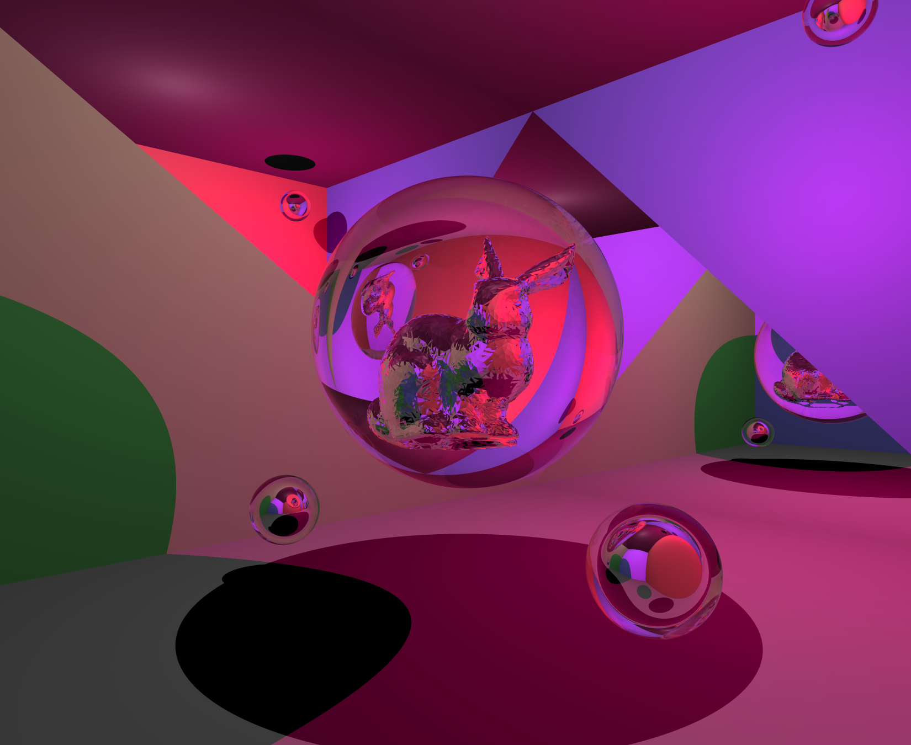
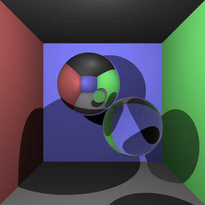

# COMP30019 - Project 1 - Ray Tracer

This is your README.md... you should write anything relevant to your
implementation here.

Please ensure your student details are specified below (*exactly* as on UniMelb
records):

**Name:** Matthew Thao Dang Pham \
**Student Number:** 1273607 \
**Username:** MATTHEWTP \
**Email:** matthewtp@student.unimelb.edu.au

## Completed stages

Tick the stages bellow that you have completed so we know what to mark (by
editing README.md). **At most 9** marks can be chosen in total for stage
three. If you complete more than this many marks, pick your best one(s) to be
marked!

<!---
Tip: To tick, place an x between the square brackes [ ], like so: [x]
-->

##### Stage 1

- [x] Stage 1.1 - Familiarise yourself with the template
- [x] Stage 1.2 - Implement vector mathematics
- [x] Stage 1.3 - Fire a ray for each pixel
- [x] Stage 1.4 - Calculate ray-entity intersections
- [x] Stage 1.5 - Output primitives as solid colours

##### Stage 2

- [x] Stage 2.1 - Diffuse materials
- [x] Stage 2.2 - Shadow rays
- [x] Stage 2.3 - Reflective materials
- [x] Stage 2.4 - Refractive materials
- [x] Stage 2.5 - The Fresnel effect
- [x] Stage 2.6 - Anti-aliasing

##### Stage 3

- [ ] Option A - Emissive materials (+6)
- [ ] Option B - Ambient lighting/occlusion (+6)
- [x] Option C - OBJ models (+6)
- [ ] Option D - Glossy materials (+3)
- [x] Option E - Custom camera orientation (+3)
- [ ] Option F - Beer's law (+3)
- [ ] Option G - Depth of field (+3)

Please summarise your approach(es) to stage 3 here.*

OBJ models:
- Loaded in vertices, vertex normals and faces with simple string parsing
- Faces are stored as an array of Triangle primitives
- Triangles updated to store information about both vertexs and vertex normals
- Bool hasVertexNormals allows for conditional vertex normal interpolation for the
sake of 'smoother' shading of obj surface (since obj provides surface normals but
a normal triangle primitive doesn't)
- Optimised Obj ray collision detecting using AABB ray collision
- Using Multithreading to speed up obj triangle collision detection

Custom Camera orientation:
- Used Rodrigues' Rotation Formula using left handed coordinate system
- Applied extra logic to allow rotations from -360 -> 360 degress

## Final scene render



This render took **49** minutes and **44** seconds on my PC.

I used the Release Configuration to render this, but the sample scenes should still
render fine on Debug.

I used the following command to render the image exactly as shown:

```
dotnet run --configuration Release -- -f tests/final_scene.txt -o images/final_scene.png --cam-pos -1.2,-0.4,2.7 --cam-axis 0,1,0 --cam-angle 134 -w 1650 -h 1350 -x 4
```

## Sample outputs

We have provided you with some sample tests located at ```/tests/*```. So you
have some point of comparison, here are the outputs our ray tracer solution
produces for given command line inputs (for the first two stages, left and right
respectively):

###### Sample 1

```
dotnet run -- -f tests/sample_scene_1.txt -o images/sample_scene_1.png -x 4
```

<p float="left">
  
   
</p>

###### Sample 2

```
dotnet run -- -f tests/sample_scene_2.txt -o images/sample_scene_2.png -x 4
```

<p float="left">
  
   
</p>

## References

#### Primitives Collision
- Used university resources for plane and triangle collision
  
- For Spheres:

  Ray-Sphere Intersection with Simple Math: 
  <u>http://kylehalladay.com/blog/tutorial/math/2013/12/24/Ray-Sphere-Intersection.html</u>

#### Normal interpolation

- The color here interpolation can be easily extended for surface normals

  Scratchapixel - Barycentric Coordinates: 
  <u>https://www.scratchapixel.com/lessons/3d-basic-rendering/ray-tracing-rendering-a-triangle/barycentric-coordinates#:~:text=To%20compute%20the%20position%20of,(barycentric%20coordinates%20are%20normalized).</u>

#### Reflection, Refraction and Fresnel
- I used scratchapixel mostly just for the fresnel equations, and to understand total internal reflection.
But I used the youtube video and the Fresnel wiki for most of the implementation, partly because there 
were errors in scratchapixel and some of the diagrams made no sense. The end result is a mix of all three 
approaches, although I did take the variable names from scratchapixel because they made the most sense given that most explanations of these concepts use the same names (etaT, etaI, eta, cosI). Reflection is literally
one equation I took from StackExchange

  Scratchapixel - Reflection-Refraction-Fresnel: 
  <u>https://www.scratchapixel.com/lessons/3d-basic-rendering/introduction-to-shading/reflection-refraction-fresnel#:~:text=Remember%20that%20ray-tracing%20is,reflection%20direction%20in%20this%20example</u>

  StackExchange - How to get a reflection Vector:
  <u>https://math.stackexchange.com/questions/13261/how-to-get-a-reflection-vector</u>

  Fresnel Equations - Wikipedia: 
  <u>https://en.wikipedia.org/wiki/Fresnel_equations</u>

  Introduction to Computer Graphics (Lecture 11): Ray tracing; reflection and refraction; ray trees: 
  <u>https://youtu.be/Tyg02tN9oSo</u>

#### AABB ray collision
- Only used AABB to calculate if a collision had occured, not the hitpoint itself since it was mostly
unnecessary

  Scratchapixel - Ray-box-intersection: 
  <u>https://www.scratchapixel.com/lessons/3d-basic-rendering/minimal-ray-tracer-rendering-simple-shapes/ray-box-intersection</u>


